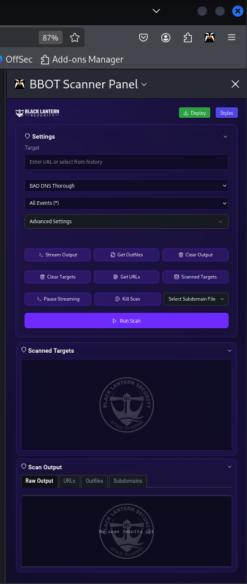
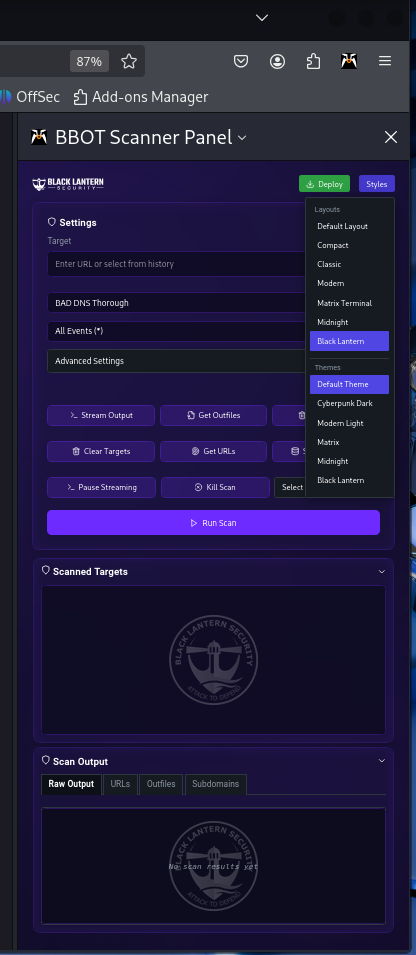
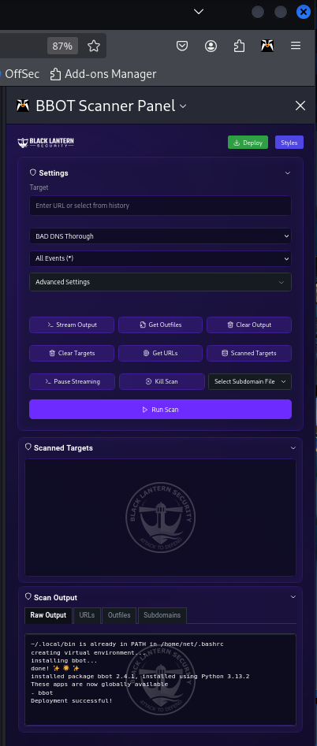

# BBOT Scanner Firefox Extension

A Firefox extension that provides a user interface for the BBOT (Bug Bounty Recon Tool) scanner. This extension allows you to run various security scans directly from your browser with a sleek, customizable interface.

## Screenshots

The following images showcase the BBOT Scanner Firefox Extension's user interface, including theme selection, deployment, and extension view:
<div style="display: flex; justify-content: space-between; gap: 10px;">
  
  
  
</div>

## Features

- Multiple scan types including:
  - BAD DNS Thorough
  - Cloud Enumeration
  - Code Enumeration
  - Directory Brute-force (Heavy/Light)
  - .NET/IIS Audit
  - Email Enumeration
  - IIS Shortname Enumeration
  - Web Spider
  - Subdomain Enumeration
  - Web Scanning (Basic/Thorough)
  - And more...

- Real-time scan output streaming
- Customizable UI themes:
  - Default
  - Dark (Cyberpunk)
  - Light (Modern)
  - Matrix Terminal
  - Midnight
  - Black Lantern

- Layout options:
  - Default
  - Compact
  - Classic
  - Modern
  - Matrix
  - Midnight
  - Black Lantern

- Advanced scanning options:
  - Event type filtering
  - Module dependency management
  - Burp proxy integration
  - Scope control
  - Flag type selection

## Installation

### Prerequisites

- Firefox Browser
- Python 3.x
- BBOT installed via pipx

### Setup

1. Clone the repository:
```bash
git clone <repository-url>
cd bbot-scanner
```

2. Install dependencies:
```bash
npm install
```

3. Build the extension:
```bash
npm run build
```
This will create a `bbot-scanner.xpi` file in the project root.

### Loading in Firefox

1. Open Firefox and navigate to `about:debugging`
2. Click "This Firefox" on the left

## Project Structure

```
.
├── host/                      # Native messaging host components
│   ├── bbot_host.json        # Native messaging host manifest
│   └── bbot_host.py          # Python bridge to BBOT
├── src/
│   ├── assets/               # Images and icons
│   ├── styles/               # CSS styling
│   │   └── layouts/         # Layout-specific styles
│   ├── App.jsx              # Main React component
│   └── main.jsx             # React entry point
├── build.bat                 # Windows build script
├── build.sh                  # Unix build script
├── deploy.sh                # Deployment script
└── manifest.json            # Extension manifest
```

## Native Messaging Host

The extension communicates with BBOT through a Python-based native messaging host that:
- Handles communication between the extension and BBOT
- Manages scan execution
- Streams real-time results
- Saves scan outputs locally

## Development

### Building

```bash
npm run build
```

### Development Server

```bash
npm run dev
```

### Preview

```bash
npm run preview
```

## Themes and Layouts

The extension supports multiple themes and layouts that can be changed via the Styles button in the UI. Each theme/layout combination provides a unique visual experience while maintaining full functionality.

## Security Features

- Native messaging for secure BBOT integration
- Proper error handling and validation
- Scope control options
- Burp proxy integration support

## License

[Add License Information]

## Credits

- BBOT - Bug Bounty OSINT Tool
- Black Lantern Security
