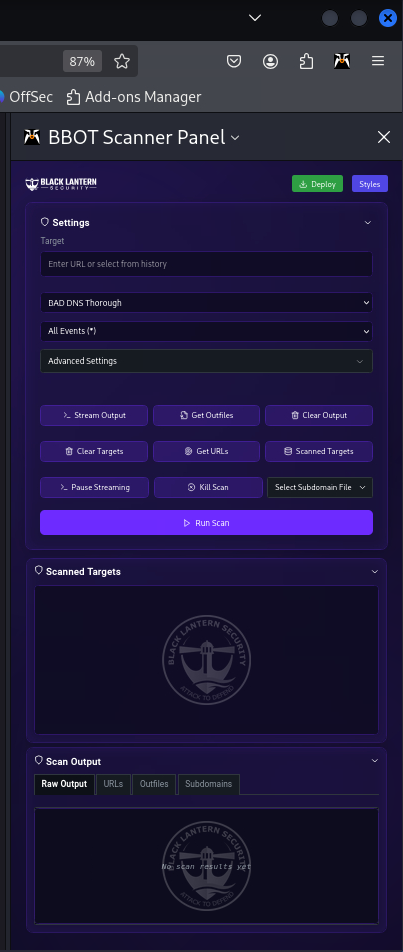
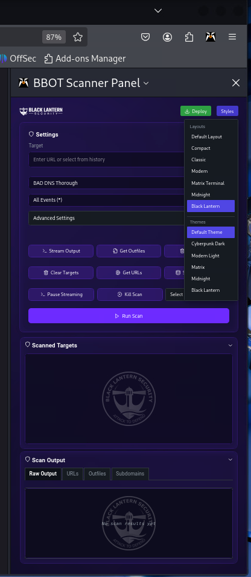
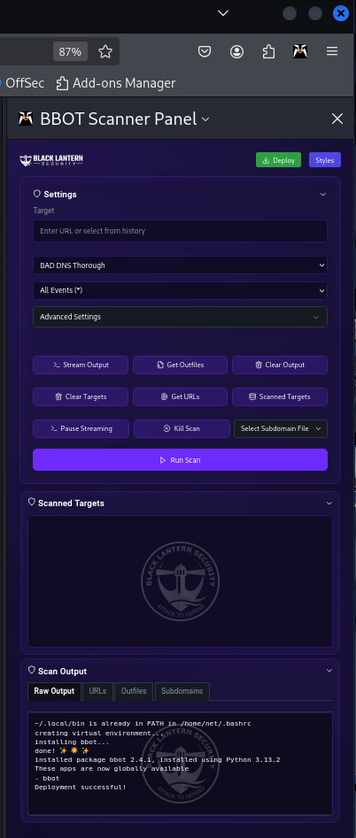

# ( Still Under-DEV ) 

## BBOT Scanner Firefox Extension

A Firefox extension that provides a user interface for the BBOT (Bug Bounty Recon Tool) scanner. This extension allows you to run various security scans directly from your browser with a sleek, customizable interface.

## Screenshots

The following images showcase the BBOT Scanner Firefox Extension's user interface, including theme selection, deployment, and extension view:
<div style="display: flex; justify-content: space-between; gap: 10px;">
  
  
  
</div>

## Features

- Multiple scan types including:
  - BAD DNS Thorough
  - Cloud Enumeration
  - Code Enumeration
  - Directory Brute-force (Heavy/Light)
  - .NET/IIS Audit
  - Email Enumeration
  - IIS Shortname Enumeration
  - Web Spider
  - Subdomain Enumeration
  - Web Scanning (Basic/Thorough)
  - And more...

- Multi-target scans with one target per line
- Add recent domains from browser history into the target list
- Real-time scan output streaming
- Custom scan names for easier report tracking
- Additional BBOT output modules can be enabled from the sidebar
- Sidebar profiles with `Light`, `Heavy`, and `Custom` layouts
- Customizable UI themes:
  - Default
  - Dark (Cyberpunk)
  - Light (Modern)
  - Matrix Terminal
  - Midnight
  - Black Lantern

- Layout options:
  - Default
  - Compact
  - Classic
  - Modern
  - Matrix
  - Midnight
  - Black Lantern

- Advanced scanning options:
  - Event type filtering
  - Module dependency management
  - Module include and exclude controls
  - Flag include, require, and exclude controls
  - Burp proxy integration
  - Strict scope
  - Whitelist targets
  - Blacklist targets
  - Additional output/report modules

- Split sidebar controls for smaller layouts:
  - `Light` keeps only the core scan and output sections visible
  - `Heavy` exposes the full control surface in one scrolling sidebar
  - `Custom` lets users choose visible sections, save named layouts with appearance settings, and import/export layout files

## Installation

### Prerequisites

- Firefox Browser
- Python 3.x
- Node.js and npm

### Setup

1. Clone the repository:
```bash
git clone <repository-url>
cd BBOT-Xtension
```

2. Install the native host runtime and BBOT:
```bash
bash install.sh
```

This copies the native messaging host into `~/.local/share/bbot-xtension`,
registers Firefox native messaging, and installs or upgrades the stable BBOT
release.

3. Install frontend dependencies:
```bash
npm install
```

4. Build the extension:
```bash
npm run build
```
This will create a `bbot-scanner.xpi` file in the `BBOT-Xtension/` project root.

### Loading in Firefox

1. Open Firefox and navigate to `about:debugging`
2. Click "This Firefox" on the left
3. Click "Load Temporary Add-on" and select `bbot-scanner.xpi`

### Runtime Behavior

- If the native host is missing, the panel shows a setup-required message.
- If BBOT is missing, the panel shows `Deploy BBOT`.
- If BBOT is installed but out of date, the panel shows `Update BBOT`.
- If BBOT is current, the button is hidden.
- Presets, modules, output modules, flags, and event types are loaded from the installed BBOT runtime.
- Targets can be entered one per line to run a scan against multiple targets.
- Scope options are available through `Whitelist`, `Blacklist`, and `Strict Scope`.
- Scan names and additional output modules can be set before a run to control report naming and extra BBOT artifacts.
- The sidebar mode can be switched between `Light`, `Heavy`, and `Custom`.
- `Light` is intended to keep the sidebar focused on the core scan flow.
- `Heavy` keeps advanced controls and output panels in the same scrolling stack so results stay usable when the full UI is enabled.
- `Custom` includes a sidebar builder where users can choose visible sections, save named layouts locally, delete them, or export/import them as JSON files.
- Saved custom layouts now include sidebar visibility plus the selected extension layout and theme.
- Custom layout files store UI preferences only. BBOT presets, modules, flags, output modules, and event types still load dynamically from the installed BBOT runtime.

## Project Structure

```
.
├── host/                      # Native messaging host components
│   ├── bbot_host.json        # Native messaging host manifest
│   └── bbot_host.py          # Python bridge to BBOT
├── install.sh                # First-time Linux bootstrap
├── src/
│   ├── assets/               # Images and icons
│   ├── styles/               # CSS styling
│   │   └── layouts/         # Layout-specific styles
│   ├── App.jsx              # Main React component
│   └── main.jsx             # React entry point
├── deploy.sh                # Deployment script
└── manifest.json            # Extension manifest
```

## Native Messaging Host

The extension communicates with BBOT through a Python-based native messaging host that:
- Handles communication between the extension and BBOT
- Manages scan execution
- Streams real-time results
- Saves scan outputs locally

Run `bash install.sh` once on Linux before using the extension. The install step
copies the native runtime into `~/.local/share/bbot-xtension`, registers the
host with Firefox, and installs or upgrades BBOT. After that, the in-panel
`Deploy BBOT` or `Update BBOT` button uses the installed runtime.

## Development

Ensure that each text-based source file ends with a trailing newline. This avoids
editor warnings and keeps the project POSIX compliant.

### Building

```bash
npm run build
```

### Development Server

```bash
npm run dev
```

### Firefox Development Run

```bash
npm run dev:firefox
```

This builds the extension and launches Firefox with the current development build loaded.

### Preview

```bash
npm run preview
```

### Running Tests

```bash
npm test
```

```bash
npm run test:js
```

## Themes and Layouts

The extension supports multiple themes and layouts that can be changed via the Styles button in the UI. Each theme/layout combination provides a unique visual experience while maintaining full functionality.

## Security Features

- Native messaging for secure BBOT integration
- Proper error handling and validation
- Scope control options
- Burp proxy integration support

## License

This project is licensed under the [MIT License](LICENSE).

## Credits

- BBOT - Bug Bounty OSINT Tool
- Black Lantern Security
